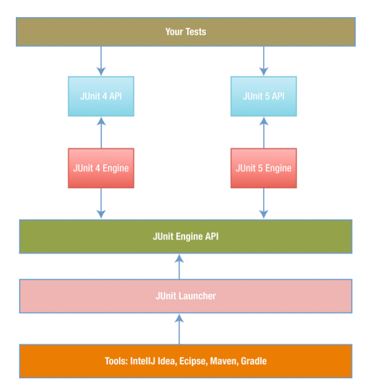

# JUnit 5: Introduction

## Overview

**This introduction is taken from [Shekhar Gulati and Rahul Sharma, Java Unit Testing with JUnit 5](https://doi.org/10.1007/978-1-4842-3015-2_1)**

Unit testing and test driven development have now become part of every developer's skill set.
For Java developers, the most popular testing tool has been JUnit, and JUnit 5 is built using the latest features of Java.  
With Java Unit Testing with JUnit 5, you'll master these new features, including method parameters, extensions, assertions and assumptions,
and dynamic tests. You'll also see how to write clean tests with less code.

## Table of Contents
[Characteristics of Good Unit Tests](#characteristics-of-good-unit-tests)

[Why was JUnit 5 needed?](#why-was-junit-5-needed)

[JUnit 5 in a nutshell](#junit-5-in-a-nutshell)

## Characteristics of Good Unit Tests
Tests should be written with the same focus and clarity as the production code.
We must refactor test cases so that they are kept lean and correct.
Tests will only reap benefits if people can understand and rely on them.

When following TDD, high-quality tests are the key to success.
It’s one thing merely to have tests, and another thing to have high-quality tests.
The tests need to have several characteristics so that they remain useful throughout their life. They should be

* **Readable**: One of the goals of a test is to educate its reader about what the unit being tested will do.
  If the tests are not readable then the reader will not be able to understand when the tests will fail.
  A good unit test case has a meaningful name so that the reader understands the behavior of unit being tested
  without looking at implementation details.

* **Fast**: Tests should run in few seconds so that they provide quick feedback.
  If tests take more time, the programmer will look for ways to skip the tests.
  Unit tests must mock external dependencies so that the tests run fast and independent of external services.
  Mocking allows testing of a unit of code by simulating behaviour of its dependencies in a controlled manner.

* **Independent and Isolated**: Good unit tests are independent of execution order.
  They don’t rely on other unit tests for them to work correctly.
  They should run independently in their own isolated environment.

* **Correct**: A good unit test does what it says. A test case should correspond to a single case (i.e., behavior).
  Often tests don’t do what their name suggests.
  This is very risky, as in that case you can’t trust your tests.

* **Environment agnostic**: A litmus test for any software project is the following:
  “Can you check out the code on a clean developer machine and run the full build including tests without any problem.”
  Most of the time, we find that unit tests fail because they depend on some external factor.
  The external factor could be a file at a particular location, an environment variable, or something else.
  This leads to brittle tests. A good unit test does not depend on the environment.

* **Repeatable**: A good unit test produces the same result each time you run it.
  Test execution should be automated using the build tool.
  They should be part of the automated build process so that they run each time you execute build.
  When tests start failing randomly, programmers start ignoring them.
  These random test failures are difficult to reproduce and normally happen on external systems like continuous integration servers.
  Team should ensure that failing tests are fixed as soon as they are discovered.

## Why was JUnit 5 needed?
As developer testing gained momentum and maturity over the last few years,
developers began to expect more from their unit-testing framework.
Following are the reasons a new version was required:

* **Features**: Developers want their testing framework to support integration testing, better assertions,
  and many other features so that they don’t have to rely on other libraries.

* **Modularity**: Earlier versions of JUnit lack modularity. Everything is packaged as one single jar.
  There is a single JUnit project, which contains all JUnit code base. It achieves modularity by using different subpackages.
  This means everyone is dependent on JUnit jar—build tools, IDE, your JUnit tests, extensions, and so on, all using the same code.
  Test discovery and test execution are one example of concern regarding tight coupling.

* **Extensibility**: JUnit 4 provided extensibility using two mechanisms:

    - _Runner API_ (application programming interface)
    - _Rule API_

      They both had their strengths and limitations. To write a custom test runner, you have to implement the complete test life cycle,
      which includes test instantiation, test execution, setup and teardown, and so on.
      The biggest drawback of Runner API is that you can’t combine multiple runners together. Rule API introduced in JUnit 4.7 is much simpler to work
      with but is limited in what it can do. One limitation of Rule API was that there couldn’t be a single rule for both method-level and class-level
      callbacks. This left a lot from JUnit in terms of extensibility.

* **Java 8**: Java 8 introduces a lot of new features like lambdas.
  You can use Java 8 with previous versions of JUnit, but JUnit itself
  can be improved a lot by supporting these features.

## JUnit 5 in a nutshell
To overcome the limitations mentioned previously, JUnit Lambda project was initiated.
JUnit Lambda was the code name for JUnit 5. JUnit 5 is a complete rewrite of JUnit in Java 8.
It is redesigned from the ground up, overcoming the mistakes and limitations of previous JUnit versions.
This does not mean that tests written in JUnit 3 and JUnit 4 will not work with JUnit 5.
JUnit team has made sure that JUnit 5 is backward compatible, so you can run your old JUnit tests with it as well.
JUnit 5 supports JUnit 3.8 and above versions.

JUnit 5 is composed of three subprojects. Each of these subprojects has multiple modules:

* **JUnit Platform**: This provides a foundation for launching JVM (Java Virtual Machine) testing frameworks.
  This includes a TestEngine API that can be used to develop a testing framework for JUnit Platform to run.
  It also provides a ConsoleLauncher that build tools like Gradle and Maven can use.

* **JUnit Jupiter**: This provides the new programming model for writing tests.
  Also, the new extension mechanism is part of this subproject.
  It implements the TestEngine API defined by JUnit Platform so that JUnit 5 tests can be run.

* **JUnit Vintage**: This provides a TestEngine implementation for running JUnit 3 and JUnit 4 tests.

The main modules in JUnit 5 are

* **junit-jupiter-api**: This module defines the API that you need to write your tests.

* **junit-platform-launcher**: This module defines the launcher API that external tool use. Launchers can be used to discover, filter, and execute tests.

* **junit-platform-engine**: This provides the API that you can use to write your own TestEngine. TestEngine is responsible for the discovery and execution of tests.

* **junit-jupiter-engine**: It is the implementation of junit-platform-engine API for JUnit 5.

* **junit-vintage-engine**: It is the implementation of junit-platform-engine API for JUnit 3 and JUnit 4.

* **junit-platform-commons**: It contains all the utilities which are used across different modules.

* **junit-platform-console**: This provides an implementation of a launcher called ConsoleLauncher. ConsoleLauncher is a stand-alone application used to launch JUnit platform from the console.

* **junit-platform-gradle-plugin**: This is a Gradle plug-in that can be used to run JUnit 5 tests.

* **junit-platform-surefire-provider**: This module provides Maven integration for JUnit 5.

## Appendix
[1]: Citation from [Shekhar Gulati and Rahul Sharma, Java Unit Testing with JUnit 5](https://doi.org/10.1007/978-1-4842-3015-2_1)
